```{=latex}
\begin{abstract}
```

*Remember the Decision, Not the Description* (Zou et al., 2026) argues
that a memory's value comes not from its similarity to the current
situation, but from how much its loss would change the agent's future
decision. We test an operational consequence of this idea for
retrieval memory: retrieval by the *direction* vector of a transition
(by analogy with bacterial chemotaxis: run/tumble along a gradient,
not absolute position) against retrieval by point-wise semantic
similarity. We build a synthetic environment with a controllable
relationship between similarity and usefulness (two modes) and compare
four retrieval methods at an equal memory budget on a geometric
kNN agent (Tier 1, a statistically powerful test) and on a real LLM
agent (Tier 2, `Qwen2.5-0.5B-Instruct`). The central hypothesis is not
confirmed: after Holm-Bonferroni correction for multiple comparisons,
chemotaxis nowhere statistically significantly outperforms point
cosine, and at low-to-medium `p` it is significantly worse than it and
than concat cosine almost everywhere. The result reproduces on real
dialogues (LoCoMo, 1986 questions) with no construction aimed at that
outcome. Our own hypothesis about the optimal direction window
depending on environment non-smoothness is also rejected. We then
formulate and test a second, derived hypothesis: direction must be a
useful signal if the correct action is a function of the *transition*
itself, not of the pair of states, and the representation is
sufficiently linear with respect to that transition. In this specially
constructed regime, chemotaxis statistically significantly outperforms
concat, but only in a narrow window of moderate signal strength: real
text embeddings have no such linear structure, and the advantage does
not appear anywhere. A trained PyTorch combinator over the same
features shows a similar picture: in the main environment the
contribution of direction is small but nonzero, while in the specially
constructed one it is large and statistically robust. A negative
result in the main setting and a positive one in the derived setting
together give a coherent, testable answer to the "when" question: not
"always works" and not "never works," but dependent on a specific,
measurable condition on task and representation structure.

```{=latex}
\end{abstract}
```

## 1. Introduction

An agent that works with users or an environment for a long time
cannot keep the entire history in context and must decide what to
remember. The standard answer: store and retrieve by semantic
similarity (RAG-style: embedding of the current situation against
embeddings of past episodes). DeMem proposes a different criterion:
the value of a memory is determined not by similarity but by whether
losing it would change a future decision.

**Biological motivation.** The name and mechanism refer to chemotaxis
in *E. coli*. The bacterium is physically too small to sense a
difference in attractant concentration across space along the length
of its own body — a spatial gradient is imperceptible to it. Instead,
it compares the concentration now to the concentration a few seconds
ago while swimming: the comparison is fundamentally temporal, not
spatial. Movement alternates between two modes — run (straight-line
swimming) and tumble (a random reorientation): if concentration rises
along the direction of travel, the tumbling frequency drops and runs
lengthen; if it falls, tumbles become more frequent, together
producing a biased random walk. Memory here is the methylation of
chemotaxis receptors, a slow biochemical process that forms a moving
average of the recent past with a characteristic timescale (the
adaptation time); the difference between the current signal and this
moving average modulates the CheY-P protein that controls tumbling
frequency (Macnab & Koshland, 1972). The advantage of such memory has
been shown to be maximal precisely when its timescale matches the
scale of fluctuations in the environment the cell swims through
(Gosztolai & Barahona, *Cellular memory enhances bacterial chemotactic
navigation in rugged environments*, Communications Physics, 2020) —
this fact directly motivates our own hypothesis H1 about the size of
the memory window `k` (§3). The idea we carry over: the organism does
not remember a point in space, it remembers the direction of change of
a signal over time and reacts statistically to that direction. Below
we formalize this as retrieval by the direction vector of a transition
between consecutive agent states, rather than by the states themselves
(§4.2).

This idea is trivially true in the special case where similarity
already correlates well with usefulness, and there any reasonable
retrieval method works equally well. The interesting question is not
"can decision-oriented memory work," but:

**Can memory organized around an agent's future decisions be more
useful than memory based on semantic similarity or recency of
experience, and if so, under what conditions does this advantage
appear and when does it disappear?**

The second half of the question matters as much as the first: a
method that never loses to simpler baselines was probably only tested
where the difference is negligible. We find the opposite in the naive
implementation of the idea. In an environment specifically constructed
so that direction is potentially informative, it statistically
significantly loses to simpler baselines almost everywhere it can be
measured (§6.1). We then formulate and test a narrower, derived
condition under which direction actually wins (§6.7), and map out its
boundaries rather than merely asserting its existence.

**Explicit scope narrowing.** DeMem formulates the decision-oriented
criterion as a counterfactual: a memory is valuable exactly to the
extent that removing it would change the chosen action, and this is
naturally operationalized as an eviction policy (at a fixed budget N,
deciding what to delete by scoring "how strongly this transaction
currently holds the voting argmax"). We test a narrower, but logically
prior, question: does the *direction* of a transition (not the
counterfactual value itself) carry a useful signal for retrieval, at
an equal budget N for all methods. All four compared methods
(recency/point/concat/chemotaxis, §4.2) are different geometries for
searching an already-fixed pool of candidates; none of them decides
what to evict from memory. This is a deliberate scoping choice, not a
hidden substitution: the assignment does not explicitly require
reproducing DeMem, and the question "is direction useful as a signal"
logically precedes the question "is a decision-value eviction policy
built on this signal useful" — a negative answer to the first removes
the need to test the second in this geometry. Implementing a
counterfactual eviction policy based on the results of §6 is a direct
candidate for the next experiment, see §9, item 1.

**Reproducibility.** This report accompanies a git repository with the
full code (`env/`, `memory/`, `agents/`, `experiments/`, `analysis/`,
`tests/`), run instructions, and a Docker image (`README.md`); every
number in this document was produced by running scripts from
`experiments/` and `analysis/` without manual intervention.

**Contributions:** (i) a controlled synthetic environment with
independently controllable "similarity-usefulness" axes, and a "gap"
task structure for testing when vector subtraction cannot in principle
lose to concatenation; (ii) a negative result for the naive
decision-oriented geometry, reproduced on real dialogues; (iii) a
trained PyTorch combinator that separates "the feature is useless"
from "this particular kNN implementation of the feature is
suboptimal"; (iv) a positive result in a specially derived boundary
regime, with a map of exactly where this advantage appears and
disappears.

## 2. Related work

**Decision-centric memory.** DeMem (Zou et al., 2026) formalizes
budgeted K-slot memory as rate-distortion compression, measuring
quality not by descriptive accuracy but by decision-quality loss, and
provides an online algorithm with regret guarantees. We test the same
underlying idea in a different setting (unbounded retrieval memory
with a fixed window N, rather than K certified slots) and at a
different level: we do not propose a new compression method, but test
whether a directional (rather than descriptive) signal works at all,
and under what conditions.

**Similarity as a memory criterion.** RAG and most long-term memory
systems for LLM agents retrieve by semantic similarity to the current
query — exactly the baseline (`point cosine`) against which we compare
decision-oriented retrieval.

**Successor representation.** Dayan (1993) shows that representing
state through expected future occupancy (rather than through immediate
description) generalizes to changes in reward better than direct
value approximation — a conceptual predecessor, decades before DeMem,
of the idea "store what is relevant to future decisions, not the
current description," in reinforcement learning.

**Biological chemotaxis motivation.** Run/tumble navigation of
bacteria along a chemical gradient (Macnab & Koshland, 1972), and the
result that cellular memory with a temporal scale matching the scale
of environmental fluctuations maximizes navigation efficiency
(*Cellular memory enhances bacterial chemotactic navigation in rugged
environments*, Communications Physics, 2020): the source of the
metaphor and the direct motivation for our own hypothesis H1 (§3).

## 3. Hypotheses

**H0 (central).** In an environment where similarity between the
current and past situation stops predicting the correct action, but
dependence on the *direction* of recent change persists, retrieval by
transition direction (chemotaxis) outperforms retrieval by point
similarity (point cosine) at an equal memory budget N.

**H1 (own, biologically motivated).** The optimal direction window
size `k` decreases as environment non-smoothness `p` increases: in a
discontinuous environment only very recent direction is informative,
while in a smooth one, averaging over a longer window is more robust
to paraphrase noise. A direct operational consequence of the result on
cellular memory and the scale of environmental fluctuations (§2).

**H2 (derived, formulated after H0 was rejected — §6.1-6.6, before the
results of §6.7).** The failure of H0 has a structural explanation
(§4.3): concatenating two vectors does not lose information (the
difference is recoverable from it, the reverse is not), so under
cosine kNN it cannot in principle systematically lose to subtraction
unless the target function is *exactly* a function of the difference
alone. This prediction follows directly from this argument, before the
experiment in §6.7 is set up: if we construct an environment where the
correct action is a function of the transition itself (source,
target) rather than of the specific pair of states, then a) point/
concat cannot generalize to a pair that was not in memory, even if
that same transition has already occurred under a different pair,
while chemotaxis in principle can; b) this advantage is realized only
if the embedding space represents the transition sufficiently
linearly, which is not guaranteed for an off-the-shelf text encoder.
H2 is false if chemotaxis does not statistically significantly
outperform concat at any level of such linear structure.

All three hypotheses are falsifiable. **Outcome: H0 and H1 are
rejected (§6.1, §6.2); H2 is confirmed in a narrow, quantitatively
described range of conditions (§6.7).**

## 4. Method

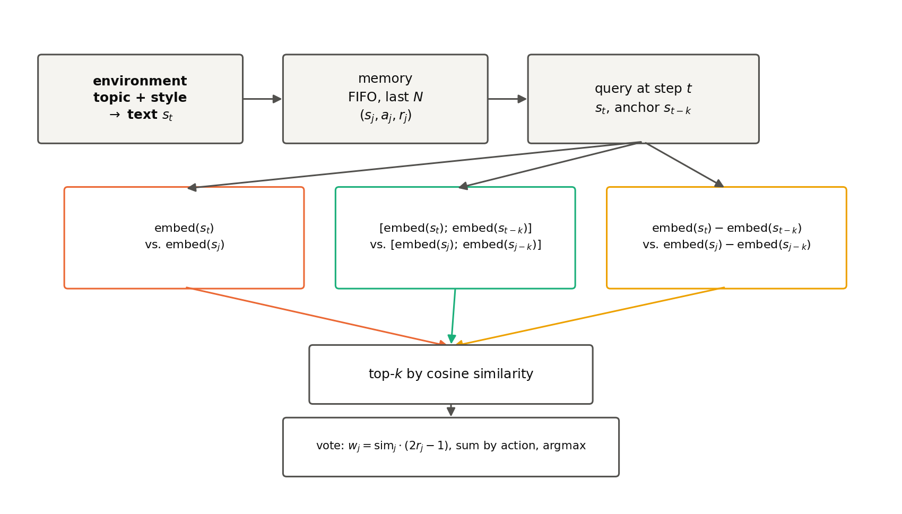

**Figure 1.** Retrieval-memory pipeline. The environment generates
text `s_t` from a (topic, style) pair; the last `N` transactions form
memory; the query is compared against each candidate in one of three
similarity spaces; the top-k vote for an action, signed by their own
correctness.

### 4.1 Environment

Synthetic support ticket routing, 6 hidden categories (`billing,
technical, account, refund, security, feature_request`). Each
situation is a short ticket: a category-specific semantic core (which
sets a "point" in embedding space), and a tone wrapper drawn from 5
styles, shared across all categories and carrying no information about
the correct action. Random slot substitution (product, amount, error
code) gives a practically unbounded space of paraphrases, deterministic
under a seed (`env/rules.py`).

At each step, with probability `1-p` the topic continues (continuation,
a new paraphrase of the same rule); with probability `p` a break
occurs (entry): the topic switches to a random different one, and the
style of the next ticket is deterministically copied from the previous
step — two consecutive tickets can sound tonally similar even though
the topic (and the correct action) has already changed.

`F[source, target]` is a table of the true action as a function of the
topic `k_env=1` step back and the current topic (`env/trajectory.py`).
Three modes:

- **mode 1** — `F[i,j]=j` for any `i`: point similarity is an
  exhaustive signal.
- **mode 2** — `F[j,j]=j` (the diagonal is identical to mode 1), and
  for `i≠j` an independent random bijection from the remaining 5
  sources to the remaining 5 actions (`F[i,j]≠j` is guaranteed).
  Similarity stops predicting the action exactly on entry steps —
  their share of a long trajectory is ≈ `p`, which is the mechanism by
  which `p` controls how much mode 2 differs from mode 1.
- **mode 3** (§4.3, H2 only) — `F[i,j] = g(j-i)` for `i≠j`: the action
  is a function of the signed gap between topics, not of the pair
  itself.

The action `a_t` that is actually written to memory is generated by a
separate naive policy: with probability `1-ε` it guesses `a_t =
topic(s_t)` (correct on all continuation steps and on mode 1 entry;
incorrect on mode 2 entry); with probability `ε=0.2` it acts randomly
— a realistic mixture of `r_t=0/1` labels without leaking oracle
knowledge.

Validation: `tests/test_trajectory_logic.py` confirms the theoretical
predictions `P(behavior correct | continuation)≈0.833`, `P(correct |
entry, mode 2)≈0.033` empirically (±0.02).
`tests/test_embeddings_sanity.py` confirms on `all-MiniLM-L6-v2`: mean
cosine within a topic is higher than between topics (0.395 vs 0.263);
style masking at a break is real (+0.014 cosine); transition vectors
`embed(target)-embed(source)` for the same pair are similar to each
other (cosine 0.170 vs -0.005 for different pairs) — the geometric
premise of chemotaxis holds at the level of raw embeddings, although,
as shown in §6, this is not sufficient for a practical advantage.

### 4.2 Memory and voting

The unit of experience is a transaction `m_t = (text s_t, action a_t,
correctness label r_t)`. The memory budget N is a fixed number of most
recent transactions (FIFO): memory at query time `t` is the slice
`[t-N, t)`, the same candidate set for all methods.

`memory/methods.py` splits geometry and decision into two layers.
`rank_candidates` is purely geometric ranking, with no notion of
action or correctness (domain-agnostic, reused unchanged in §6.5/§6.7).
`predict_action` builds voting on top of it: the top-`k=5` candidates
are weighted `w_j = sim_j·(2r_j-1)` (a transition correct in the past
votes for its action, an incorrect one votes against, analogous to
run/tumble modulation by CheY-P), weights are summed by action,
argmax; with no positive support, it falls back to the majority action
in the retrieved memory.

| method | query vector | candidate vector |
|---|---|---|
| recency | — (most recent `topk`) | — |
| point cosine | `embed(s_t)` | `embed(s_j)` |
| concat cosine | `[embed(s_t); embed(s_{t-k})]` | `[embed(s_j); embed(s_{j-k})]` |
| chemotaxis | `embed(s_t) - embed(s_{t-k})` | `embed(s_j) - embed(s_{j-k})` |

`k=1` by default (ablation — §6.2).

**Algorithm 1** Retrieval + signed vote, one query `t`
```
Input:  query t, memory [t-N, t), method ∈ {recency, point, concat, chemotaxis}, topk, k
Output: predicted action â

1:  if method = recency:
2:      candidates ← topk most recent memory indices
3:      sims ← 1 for all candidates
4:  else:
5:      q ← query_vector(method, t, k)              # see table above
6:      for j in [t-N, t):
7:          C[j] ← candidate_vector(method, j, k)
8:      sims ← cos(q, C)                               # signed, not |cos|
9:      candidates ← argtop_k(sims, topk)
10: scores ← 0 (vector over number of actions)
11: for j, sim in (candidates, sims[candidates]):
12:     scores[action(j)] += sim · (2·correct(j) - 1)
13: if max(scores) > 0:
14:     â ← argmax(scores)
15: else:
16:     â ← majority action among candidates (or global majority, if memory is empty)
17: return â
```

**Concat.** Sees exactly the same two embeddings as chemotaxis, but
without subtraction. Concatenation does not lose information (the
difference is recoverable from it, the reverse is not) — so under
cosine kNN it cannot in principle systematically lose to subtraction,
unless the target function is *exactly* a function of the difference
alone. This is a prediction derived from linear algebra before the
experiment, not found post hoc (borne out in §6.1 and overturned by
construction in §6.7).

### 4.3 Trained combinator (PyTorch)

`predict_action` forces the method to pick one similarity space and
vote in it with a fixed formula. `memory/learned.py::LearnedScorer` is
an MLP (5-16-1, tanh) over five candidate features (`point_sim,
concat_sim, chemotaxis_sim, r_sign, recency`), applied to each
candidate independently and summed by action via `scatter_add_` — a
DeepSets-style permutation-invariant aggregator, a trained
generalization of the same formula `Σ sim·(2r-1)` by action.
`feature_mask` is a buffer that zeroes out specific input columns at
the input, not post hoc, for clean ablations (`full`, `no_chemotaxis`,
`chemotaxis_only`). Train/val/test are split by `seed` (a whole
environment instantiation with its own F-table), not by individual
(trajectory, checkpoint) pairs — otherwise the model would see
checkpoints from the same F-table during training, which is equivalent
to `train_test_split` without accounting for the group.

### 4.4 Agents

Tier 1 is `agents/knn_agent.KNNVoteAgent`, a wrapper around
`predict_action`: cheap, allows a full factorial run with 10 seeds per
cell, the main source of quantitative conclusions. Tier 2 is
`agents/llm_agent.LLMRouterAgent`, `Qwen2.5-0.5B-Instruct` via Hugging
Face Transformers, a real forward pass: the action is chosen by
scoring the mean log-likelihood of the prompt continuation for each of
the 6 labels (deterministic, without parsing free generation). The
prompt includes the `topk` transactions retrieved by the same method,
correct and incorrect ones marked explicitly, with no hint of the
right answer.

### 4.5 Controls

- **Control 1 (shuffled r).** Correctness labels `r_t` are shuffled
  across the whole memory: expectation — all methods should drop to
  chance.
- **Control 2 (shuffled d).** `r_t` and `a_t` are left untouched, but
  the "anchor" `t-k` is replaced with a random, unrelated one for both
  query and candidates: expectation — chemotaxis and concat should
  degrade, point cosine should not (it never looks at the anchor).

## 5. Experimental protocol

Parameters are fixed in `experiments/config.py` before the run. Action
space size is 6, `topk=5` for all methods, `k=1` by default unless
stated otherwise.

| Experiment | Parameters | Seeds |
|---|---|---|
| Main curve (§6.1) | `N=40`, `p∈{0,.15,.3,.5,.65,.8,.9,1}` (full grid), both modes | 10 |
| Budget sweep (§6.3) | `N∈{10,20,40,80}`, `p=0.5` | 10 |
| k×p ablation (§6.2) | `k∈{1,2,4,8}`, `p∈{0,.25,.5,.75,1}`, `N=40` | 8 |
| Controls (§6.1) | mode 2, `p∈{0.3,0.6,0.9}`, `N=40`, result reported per `p` separately | 10 |
| Tier 2 (§6.4) | `p∈{0,.25,.5,.75,1}`, both modes, `N=40`, 12 eval points/trajectory | 3 |
| Trained combinator (§6.6) | mode 2, `N=40`, `p∈{.15,...,1.0}`, 60 epochs, Adam `lr=0.02`, split seed 0-39/40-49/50-59 | 60 |
| H2/relational (§6.7) | mode 3, `p=0.5`, `α∈{0,.5,1,2,4,8}`, `N=40`, 400 eval points/trajectory, entry steps only | 20 |

Statistics: `analysis/stats_tests.py`, paired t-tests across seeds,
Holm-Bonferroni correction applied separately per mode, with the
family being the entire tested `p` grid (not a post hoc selected
subset); McNemar's test for pairwise comparisons of trained models on
a shared test set, also Holm-Bonferroni-corrected over the family of
comparisons within each experiment (3 pairs in §6.6, 2 in §6.7).

## 6. Results

### 6.1 Main stability curve (H0)

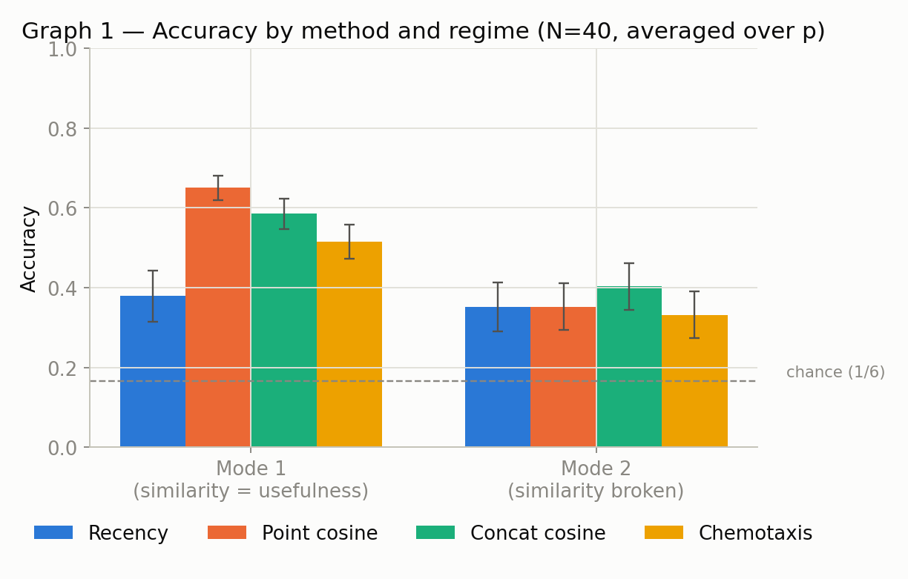
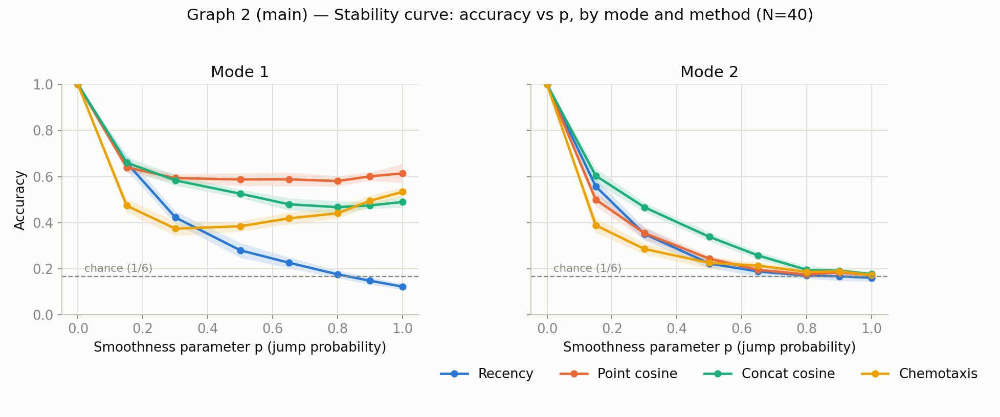

**Figure 2.** Accuracy vs `p`, `N=40`, both modes. (a) Comparison
across modes at fixed `p`. (b) Full curve over all 8 values of `p`.

| mode | p | recency | point | concat | chemotaxis |
|---|---|---|---|---|---|
| 1 | 0.00 | 1.000 | 1.000 | 1.000 | 1.000 |
| 1 | 0.15 | 0.660 | 0.640 | 0.661 | 0.474 |
| 1 | 0.30 | 0.422 | 0.593 | 0.584 | 0.374 |
| 1 | 0.50 | 0.279 | 0.588 | 0.526 | 0.384 |
| 1 | 1.00 | 0.122 | 0.614 | 0.489 | 0.534 |
| 2 | 0.00 | 1.000 | 1.000 | 1.000 | 1.000 |
| 2 | 0.15 | 0.557 | 0.500 | 0.604 | 0.388 |
| 2 | 0.30 | 0.350 | 0.354 | 0.466 | 0.285 |
| 2 | 0.50 | 0.222 | 0.243 | 0.338 | 0.225 |
| 2 | 1.00 | 0.160 | 0.172 | 0.176 | 0.172 |

(full table over all 8 `p` values — `results/tables/summary_graph2_stability.csv`)

In mode 1, chemotaxis is consistently the worst of the three
content-aware methods at every `p>0`, significantly worse than point
and concat at 6 of 7 nonzero `p` values (Holm-Bonferroni,
`results/tables/stats_tests.csv`).

In mode 2, concat is consistently the best method over almost the
entire range (significantly better than chemotaxis at `p=0.15…0.65`).
Chemotaxis is statistically significantly *worse* than point cosine at
`p=0.15` and `p=0.30` — exactly where H0 predicted an advantage, the
opposite effect is observed; at `p≥0.5` the difference is statistically
indistinguishable from zero (raw p-values 0.08-0.94). Chemotaxis shows
no significant advantage over point cosine at any point.

**Mechanism** (`p=0.5`, broken down by step type, entry share ≈ `p`):

| method | accuracy on continuation | accuracy on entry |
|---|---|---|
| recency | 0.282 | 0.163 |
| point cosine | 0.361 | 0.127 |
| concat cosine | **0.522** | 0.157 |
| chemotaxis | 0.286 | **0.165** |

On the dominant step class (continuation), chemotaxis is barely better
than recency (0.286 vs 0.282) — the transition vector within a single
topic is mostly paraphrase noise, not a stable "this topic is j"
signal. On entry steps chemotaxis is nominally ahead (0.165 vs
0.127-0.163), but the absolute level is chance (1/6≈0.167): no method
has a real signal on entry at this memory budget.

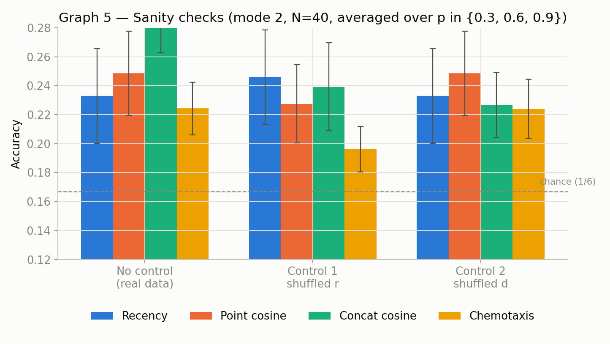

**Figure 2c.** Accuracy under control 1 (shuffled r) and control 2
(shuffled d) versus the normal condition, averaged over `p` (breakdown
by `p` is in the table below; averaging hides the asymmetry of control
1, see text).

**Controls** (mode 2, N=40, per `p` separately — averaging over `p`
hides the asymmetry): control 1 is clean at `p=0.9` (all methods
~0.17-0.18), but not at `p=0.3` (all methods 0.25-0.36 even after
label shuffling) — at low `p` memory is dominated by continuation
steps, where almost all candidates vote for the same action regardless
of label, so shuffling labels does not create alternative candidates
where none existed to begin with (a limitation of the control's
diagnostic power, not a leak — control 2 behaves normally over the
same range of `p`). Control 2: point cosine does not change anywhere
(it never looks at the anchor), concat drops noticeably at `p=0.3`
(0.466 -> 0.302), chemotaxis does not change at all at any point
(0.285 -> 0.290, 0.200 -> 0.200, 0.188 -> 0.184) — corrupting direction
has no effect, because it already contributed negligibly before the
corruption.

H0 is rejected.

### 6.2 k×p ablation (H1)

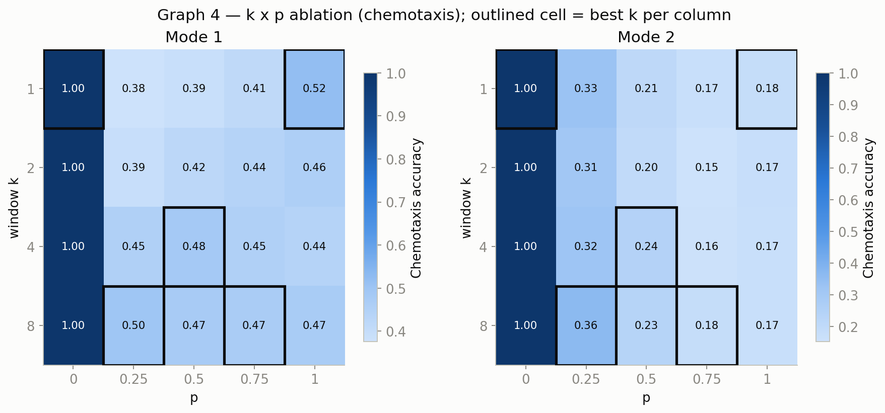

**Figure 3.** Chemotaxis accuracy as a function of window `k` and
non-smoothness `p`, mode 2, heatmap.

`analysis/stats_tests.py` tests the directional prediction of H1
directly (`k=1` significantly outperforms `k=8` at high `p` and vice
versa at low `p`): in mode 2, no `p` value survives the Holm-Bonferroni
correction; the significant effect in mode 1 (`p=0.25`, `p=0.5`) is
uninformative for H1, since there the action does not depend on the
transition source at all. **H1 is rejected**: the relationship between
`p` and the optimal `k`, if any, is weaker than detectable at the
current seed budget (`results/tables/stats_tests_h1_kp.csv`).

### 6.3 Memory budget

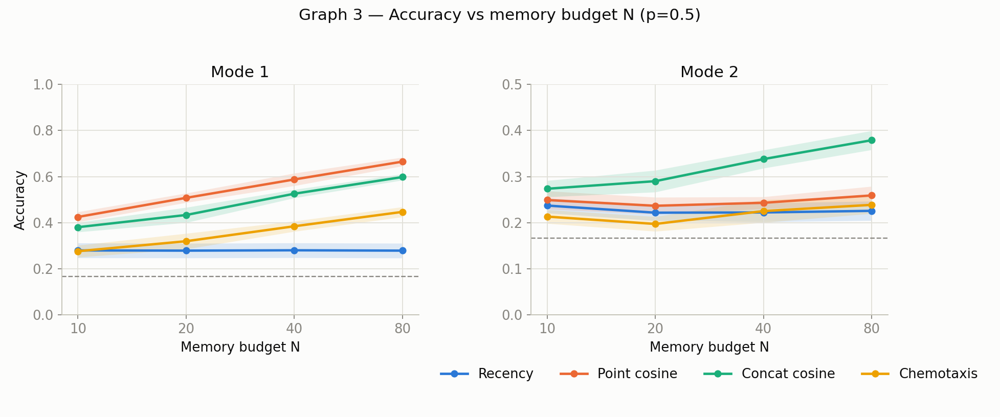

**Figure 4.** Accuracy vs memory budget `N∈{10,20,40,80}`, `p=0.5`,
both modes.

Point and concat make much more effective use of an increased budget
than chemotaxis in both modes; in mode 2, only concat grows noticeably
with `N`, chemotaxis tracks recency
(`results/tables/summary_graph3_budget.csv`).

### 6.4 Tier 2: LLM agent

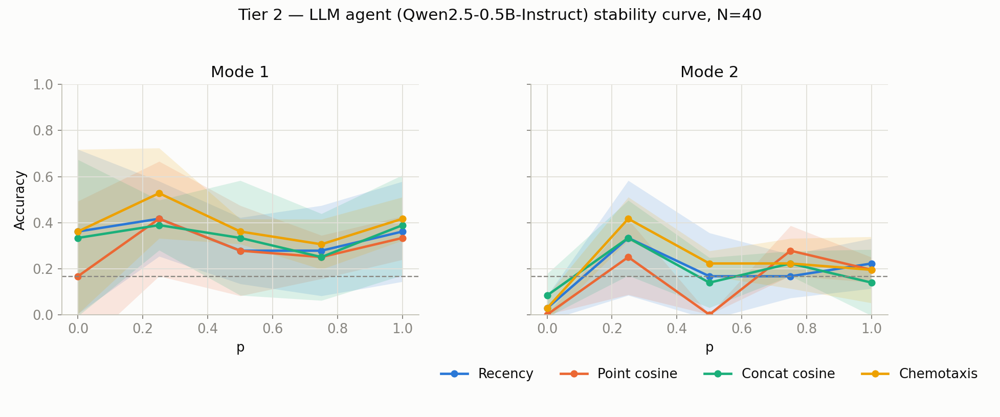
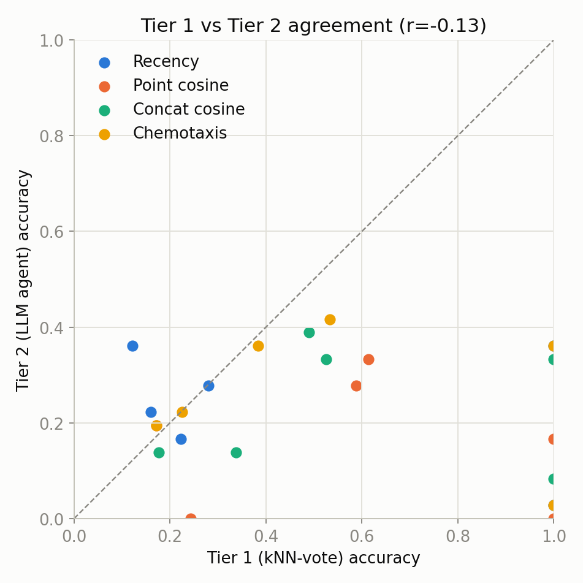

**Figure 5.** (a) Tier 2 accuracy vs `p`. (b) Agreement of method
ranking between Tier 1 and Tier 2 over matching cells.

| mode | recency | point | concat | chemotaxis |
|---|---|---|---|---|
| 1 | 0.339±0.069 | 0.289±0.066 | 0.339±0.069 | 0.394±0.071 |
| 2 | 0.183±0.057 | 0.144±0.051 | 0.183±0.057 | 0.217±0.060 |

(95% interval, normal approximation to a proportion). The intervals
overlap heavily: at a budget of 180 queries/cell, Tier 2 can neither
statistically confirm nor refute §6.1. The absolute level is much
lower than Tier 1 — a limitation of the 0.5B model itself, not
fine-tuned for the prompt format, rather than of the retrieval
mechanism (it underscores the correct category even given unambiguous
context). Method ranking in mode 2 is not qualitatively contradicted
by Tier 1, but the correlation over matching cells is r=-0.127: at
this eval-point budget, Tier 2 is not an independent confirmation of
§6.1, but a separate, statistically weakly supported observation.

### 6.5 Real data: LoCoMo

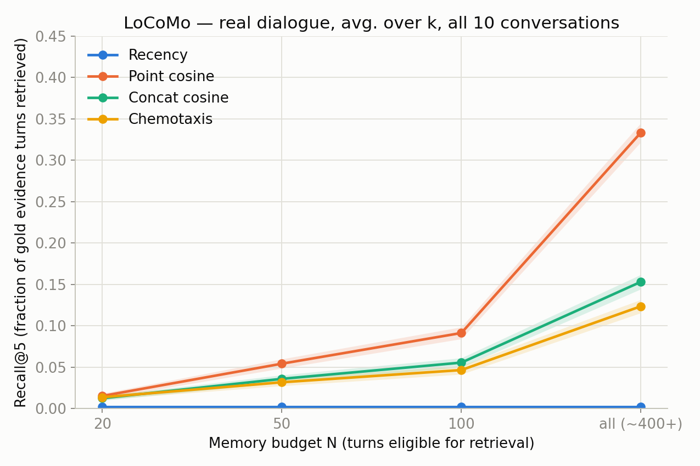

**Figure 6.** Recall@5 vs memory budget on LoCoMo, averaged over `k`
and 10 dialogues.

LoCoMo (Maharana et al.): 10 multi-session dialogues (5882 turns, 1986
QA pairs with gold evidence turns). There is no correct/incorrect
label per turn, so only `rank_candidates` (§4.2) is used, without the
voting layer — the same call as in the synthetic environment, with the
question treated as a virtual step right after the last turn
(`realdata/locomo_loader.py`, `experiments/run_locomo.py`). The metric
is recall@5/hit@5 against the gold turns.

| N (budget) | recency | point | concat | chemotaxis |
|---|---|---|---|---|
| 20 | 0.002 | 0.015 | 0.012 | 0.014 |
| 50 | 0.002 | 0.054 | 0.036 | 0.031 |
| 100 | 0.002 | 0.091 | 0.055 | 0.047 |
| all (~400+) | 0.002 | **0.335** | 0.153 | 0.123 |

Point cosine dominates without exception, in each of the 5 question
categories including temporal reasoning, where a direction advantage
might a priori have been expected (0.403 vs 0.195 for chemotaxis); the
gap grows with budget, it does not shrink. An independent confirmation
of §6.1 from a different angle: a real dialogue, where the question is
semantically close to the answering turn, is a natural analogue of
mode 1, where §6.1 already showed a significant deficit for
chemotaxis.

### 6.6 Trained combinator

Three variants of `LearnedScorer` (§4.3) were trained on mode 2
(`results/tables/learned_scorer.csv`, 14000 test episodes):

| method | test accuracy |
|---|---|
| **trained, `full`** | **0.465** |
| trained, `no_chemotaxis` | 0.434 |
| trained, `chemotaxis_only` | 0.434 |
| geometric concat (best hand-coded) | 0.324 |
| geometric point | 0.265 |
| geometric recency | 0.280 |
| geometric chemotaxis | 0.240 |

All three trained variants comfortably beat the best hand-coded method
(the voting formula of §4.2 is not trainable and loses accuracy even
in the same similarity space). Paired McNemar test on the same test
episodes:

| comparison | first only correct | second only correct | p |
|---|---|---|---|
| `full` vs `no_chemotaxis` | 1097 | 654 | ≈0 |
| `full` vs `chemotaxis_only` | 917 | 480 | ≈0 |
| `no_chemotaxis` vs `chemotaxis_only` | 1156 | 1162 | 0.92 |

`chemotaxis_only` and `no_chemotaxis` are statistically
indistinguishable: in isolation, chemotaxis does not beat point/
concat, consistent with §6.1. But `full` is significantly better than
both ablation variants (a 3.1 pp gap over `no_chemotaxis`, SE≈0.4 pp):
adding chemotaxis to point/concat gives a gain that symmetric added
noise does not — the feature carries information non-redundant with
point/concat in combination, even though it does not surpass them
alone.

### 6.7 When chemotaxis wins: relational generalization (H2)

**Construction.** mode 3 (`env/rules.py`): `F[i,j]=g(j-i)` for `i≠j`,
where `g` is a random (per-seed) table from the signed topic gap to an
action, not wrapped modulo (a cyclic wrap-around is mathematically
incompatible with exact translational invariance: rotation by a common
angle also rotates the difference of directions, so cosine between
"the same gap" degrades with cyclic distance instead of matching
exactly; see the `build_action_table` docstring). A query at an entry
step with pair (source, target) can be resolved by a candidate that
does not match this pair but has the same gap `target-source`.

`env/synthetic_embed.py` defines a controlled embedding space:
`E(topic) = identity[topic] + α·topic·ordinal_step + style[style] +
noise`, where `identity` is independent random vectors (realistic
noise, like unrelated topics in a real encoder), and `α` controls the
strength of the additive component, whose contribution to the
*difference* of two embeddings depends only on the gap, not on the
specific topics. At `α=0` the embedding lacks gap structure (a control
that reproduces the behavior of a real encoder). The exact
(non-additively-noisy) construction `E(i)=i·v` was rejected: it makes
all topic vectors collinear, a degenerate case that also distorts
point/concat (see `env/synthetic_embed.py`).

**Metric.** Not end-to-end `predict_action` accuracy: in mode 3 the
naive content-guessing policy (§4.1) is correct with the same
probability (~1/6) as random guessing, unlike mode 2, where it is
guaranteed to be wrong on entry steps by construction. That would add
a second layer of noise on top of the question this experiment is
testing. Instead, recall@5 of pure `rank_candidates` (§4.2) is used
against "gold" (other entry events in the memory window with the same
gap) — the same methodology as in §6.5 (`experiments/run_relational.py`).

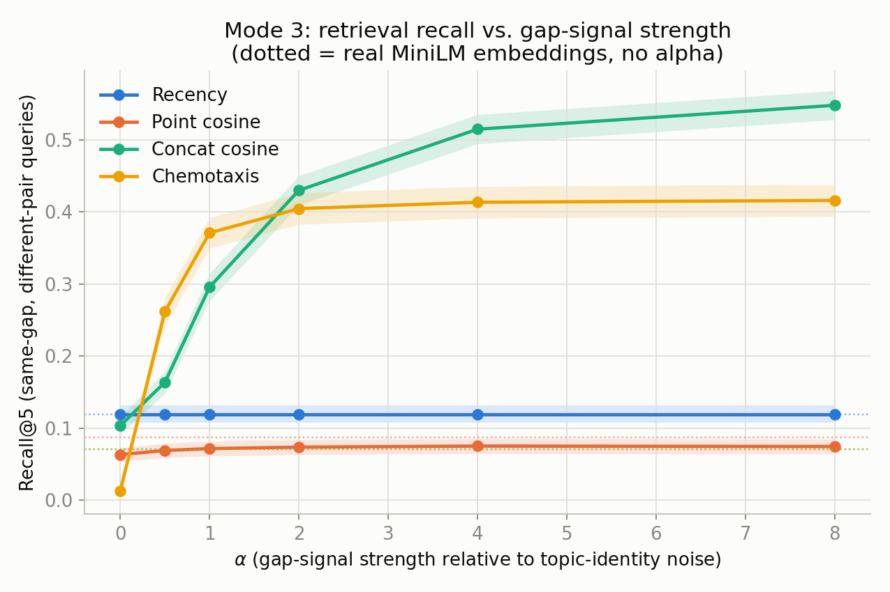

**Figure 7.** Recall@5 on queries for which the exact pair (source,
target) is absent from memory (gap only), vs the strength of the gap
signal `α`. Dashed line: real MiniLM embeddings (without `α`).

| α | recency | point | concat | chemotaxis |
|---|---|---|---|---|
| 0.0 | 0.119 | 0.063 | 0.104 | 0.013 |
| 0.5 | 0.119 | 0.069 | 0.164 | **0.262** |
| 1.0 | 0.119 | 0.072 | 0.296 | **0.371** |
| 2.0 | 0.119 | 0.074 | **0.430** | 0.405 |
| 4.0 | 0.119 | 0.075 | **0.515** | 0.414 |
| 8.0 | 0.119 | 0.075 | **0.548** | 0.416 |
| MiniLM | 0.119 | 0.088 | 0.071 | 0.071 |

At `α=0` (no gap signal), chemotaxis is the worst method, below the
recency chance level. At `α=0.5` and `α=1.0`, chemotaxis is
statistically significantly better than concat (95% confidence
intervals do not overlap, `results/tables/summary_relational.csv`):
**the only point in the entire study where decision-oriented geometry
significantly beats concat.** At `α≥2`, concat catches up and
overtakes: concatenation does not lose information, so at a
sufficiently strong linear signal it extracts almost the same
gap-invariant signal as the difference, without losing absolute
position. The structural advantage of concat from §4.2 does not go
away, it simply stops being the bottleneck at a strong signal. On real
MiniLM embeddings (without artificially added `α`), all three
content-aware methods are indistinguishable from chance (0.07-0.09):
an ordinary text encoder has no reason to represent unrelated topic
categories with a linear, gap-invariant structure, and the diagnostic
confirms this directly: mean cosine between transition vectors with
the same gap is 0.030 on MiniLM versus 0.997 at `α=8`
(`results/tables/relational_gap_structure.csv`).

**Trained combinator in this regime.** `LearnedScorer` (§4.3), trained
on mode 3, `α=1.0` (inside the winning window), entry steps only
(`experiments/train_learned_scorer_relational.py`,
`results/tables/learned_scorer_relational.csv`): `full`=0.319,
`chemotaxis_only`=0.301, `no_chemotaxis`=0.250. Unlike §6.6, here
`chemotaxis_only` is statistically significantly better than
`no_chemotaxis` (McNemar p=0.0036): chemotaxis carries standalone
value, not just in combination. `full` is significantly better than
`no_chemotaxis` (p<0.0001, a 6.9 pp gap — twice the 3.1 pp gap in
§6.6).

H2 is confirmed in a narrow range: decision-oriented retrieval
significantly beats concat when two conditions hold simultaneously:
the task is a function of the transition, not of the pair of states,
and the representation carries moderate (neither zero nor dominant)
linear structure with respect to that transition. Neither condition
holds by default in real text embeddings of unrelated categories
(§6.5, the MiniLM row here), which explains why H0 is rejected in the
main setting and on real data, without contradicting the fact that the
mechanism can in principle work where these conditions are
deliberately satisfied.

## 7. Alternative explanations

**"Concat's advantage is just from more context, not from
structure."** Rejected: concat is significantly better than chemotaxis
almost everywhere in mode 2 (§6.1, §6.3), and this was predicted by
linear algebra before the experiment (§4.2), not found post hoc.

**"There is a leak in the pipeline."** Rejected for control 1 at high
`p` (drops to chance) and fully ruled out by control 2 (chemotaxis is
insensitive to direction corruption because it has nothing to lose).
At low `p`, control 1 is less diagnostic (§6.1) — a limitation of the
control method, not a sign of a leak: control 2 behaves normally over
the same range of `p`.

**"Chemotaxis and concat retrieve almost the same thing anyway."**
Rejected.

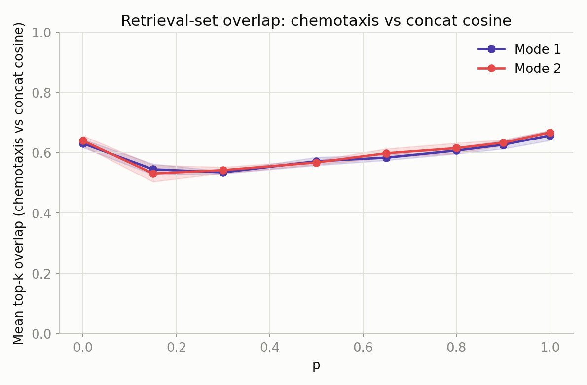

**Figure 8.** Mean top-k overlap between chemotaxis and concat vs `p`,
mode 2.

Overlap is 53-67% depending on `p` — substantial but far from
complete, while the final accuracy of the methods diverges strongly
and systematically (§6.1): the methods regularly pick different
candidates and get different decision quality.

## 8. Scope and limitations

- The work tests a narrower question than DeMem's full
  decision-oriented criterion (§1): transition direction as a
  retrieval signal at a fixed budget N, not a counterfactual eviction
  policy that would decide what to delete from memory once the budget
  fills up. None of the four methods implements eviction by decision
  influence.
- The actor whose actions are written to memory (the naive behavioral
  policy, §4.1) is not the same agent whose retrieval accuracy is
  measured (Tier 1/Tier 2, §4.4). This is not a closed lifelong loop
  where the agent's decisions shape its own future memory, but an
  evaluation of retrieval quality against a fixed history whose
  distribution is known in advance. The choice was made for control
  (the agent does not pollute its own memory unpredictably), but it
  narrows the applicability of the conclusions to settings with the
  same decoupling.
- `topk=5` is fixed independently of `N`; at `N=10` this is half of
  all memory, selection barely filters anything — the comparison
  between methods there is less informative than at `N≥20` (§6.3).
- H2 (§6.7) is an artificially constructed regime with a controlled
  embedding; the winning window (`α≈0.5-1.5`) was found at a single
  value `p=0.5` and one way of injecting the signal (additive ordinal
  code) — it has not been tested whether this specific window width
  generalizes to other `p` or to other ways of giving the
  representation gap structure.
- LongMemEval-S (DeMem's second benchmark) — the infrastructure is
  ready and working (`realdata/longmemeval_loader.py`,
  `experiments/run_longmemeval.py`), but the run has been deferred:
  turns are full chat messages, near the encoder's tokenization length
  limit, ~232K such texts for 470 questions; on CPU without a GPU this
  did not fit in a reasonable time. A cheap rerun with no code changes
  given GPU access.

The remaining limitations (diagnostic power of control 1 at low `p`,
LoCoMo's lack of its own negative controls, the trained combinator's
lack of cross-validation, the small action space size, the absence of
a comparison against DeMem itself as a baseline) are listed in the
repository's README.

## 9. Next experiment

1. **Counterfactual memory eviction policy.** A direct continuation of
   the scope narrowing from §1: instead of (or alongside) choosing a
   retrieval geometry — scoring each transaction in memory by how
   strongly removing it changes the voting argmax (§4.2), and an
   eviction policy based on this score once budget N fills up. This is
   closer to the literal formulation of DeMem's decision-oriented
   criterion than any of the four geometries tested here.
2. **Window width `α` at other `p` and other ways of injecting gap
   structure.** §6.7 found the window at a single `p=0.5` with one
   specific (additive ordinal) way of encoding the transition; it is
   untested whether the window shifts with `p`, and whether the result
   generalizes to another type of compositional signal.
3. **LongMemEval** — finish the deferred run (§8) on GPU.

The remaining backlog items (an adaptive window instead of a fixed
`k`, noise in `r_t`, more eval points in Tier 2, LoCoMo's own negative
controls, a stratified control 1) are in the repository's README.

## 10. Conclusion

The naive implementation of decision-oriented memory (retrieval by
transition direction vector via kNN voting) does not statistically
significantly outperform point cosine anywhere in the tested range of
conditions, and significantly loses to simpler baselines almost
everywhere, which is reproduced on real multi-session dialogues
without any construction aimed at that conclusion. This does not
refute DeMem's underlying idea: it shows that the specific, most
direct operationalization of "direction instead of description"
(vector subtraction) is insufficient on its own, since concatenating
the same information, losing nothing, performs better almost
everywhere. A derived experiment, worked out in advance from a
structural argument, shows the mechanism is not useless in principle:
it statistically significantly beats concat in a specially
constructed, narrow window of conditions (task is a function of the
transition, moderate linear structure in the representation), and this
window closes when the signal becomes strong (concat catches up) or is
absent (real text embeddings). A trained PyTorch combinator
independently confirms the same boundary: the contribution of the
direction feature is small in the main setting and large in the
derived one. The answer to the original question is neither "it
works" nor "it doesn't work," but a specific, measurable condition on
task and representation structure at which the boundary lies.

## Code

Repository: <https://github.com/qubeyond/t-lab_task>.

## References

- Zou, M., Guo, Z., Liang, L., et al. *Remember the Decision, Not the
  Description: A Rate-Distortion Framework for Agent Memory*.
  arXiv:2605.10870 (2026). <https://arxiv.org/abs/2605.10870>
- Dayan, P. *Improving Generalization for Temporal Difference Learning:
  The Successor Representation*. Neural Computation, 1993.
  <https://direct.mit.edu/neco/article/5/4/613/5736/Improving-Generalization-for-Temporal-Difference>
- Macnab, R. M., Koshland, D. E. *The Gradient-Sensing Mechanism in
  Bacterial Chemotaxis*. PNAS, 1972. <https://www.pnas.org/doi/10.1073/pnas.69.9.2509>
- Gosztolai, A., Barahona, M. *Cellular memory enhances bacterial
  chemotactic navigation in rugged environments*. Communications
  Physics 3, 47 (2020). <https://www.nature.com/articles/s42005-020-0312-8>
- Maharana, A., et al. *Evaluating Very Long-Term Conversational Memory
  of LLM Agents (LoCoMo)*. arXiv:2402.17753. <https://arxiv.org/abs/2402.17753>
- Wu, D., et al. *LongMemEval: Benchmarking Chat Assistants on
  Long-Term Interactive Memory*. arXiv:2410.10813. <https://arxiv.org/abs/2410.10813>
